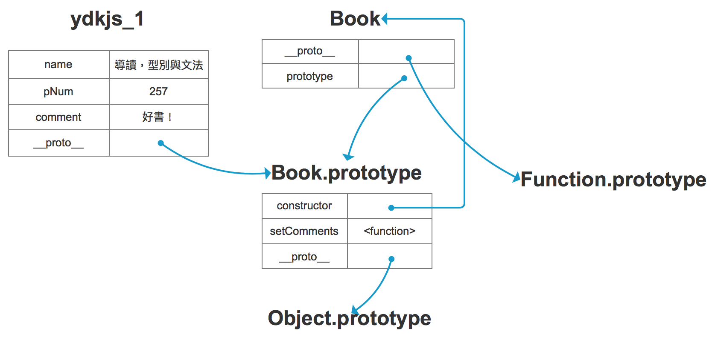

# Prototype

## 原型(Prototype)

```javascript
function Book(name, pNum) {
  this.name = name; // 書名
  this.pNum = pNum; // 頁數
  this.comment = null; // 評價
  this.setComments = function(comment) {
    this.comment = comment;
  }
}

var ydkjs_1 = new Book('導讀，型別與文法', 257);
var ydkjs_2 = new Book('範疇與閉包 / this 與物件原型', 251);

ydkjs_1.setComments('好書！');
ydkjs_1.comment // "好書！"

ydkjs_1.setComments === ydkjs_2.setComments // false
```

共用的屬性或方法，不用每次都幫實體建立一份，提出來放到 prototype 即可。承上，將 setComments 這個共用的方法放到 `Book.prototype`，暫且稱它為 Book 的原型。

```javascript
function Book(name, pNum) {
  this.name = name; // 書名
  this.pNum = pNum; // 頁數
  this.comment = null; // 評等
}

Book.prototype.setComments = function(comment) {
  this.comment = comment;
}

var ydkjs_1 = new Book('導讀，型別與文法', 257);
var ydkjs_2 = new Book('範疇與閉包 / this 與物件原型', 251);

ydkjs_1.setComments('好書！');
ydkjs_1.comment // "好書！"

ydkjs_2.setComments('超好書！');
ydkjs_2.comment // "超好書！"

ydkjs_1.setComments === ydkjs_2.setComments // true，確認是同一個函式！
```


## 原型串鏈(Prototype Chain)

當查找物件的屬性或方法時，若在本身這個物件找不到的時候，就會往更上一層物件尋找，直到串鏈尾端 `Object.prototype`，若無法找到就回傳 undefined，而這個尋找的脈絡就是依循著 `.__proto__` 這個原型串鏈（prototype chain）來找。

```javascript
ydkjs_1.__proto__ === Book.prototype // true
Object.getPrototypeOf(ydkjs_1) === Book.prototype // true
```


> 同巢狀範疇原理：若在目前執行的範疇找不到這個變數的時候，就往外層的範疇搜尋，持續搜尋直到找到為止，或直到最外層的全域範疇」。




## Questions

### 屬性(Property)

```javascript
ydkjs_1.hasOwnProperty('name') // true
ydkjs_1.hasOwnProperty('setComments') // false
```

- hasOwnProperty 只會檢查該物件，而不會檢查整條原型串鏈。
- for loop `prop in obj` 會檢查整個原型串鏈且為可列舉的屬性 。
- `prop in obj` 會檢查整個原型串鏈，不管屬性是否可列舉。


### 實體(Instance)

檢查物件是否為指定的建構子所建立的實體。

```javascript
ydkjs_1 instanceof Book // true
ydkjs_2 instanceof Book // true

ydkjs_1 instanceof Object // true
ydkjs_1 instanceof Function // true

ydkjs_2 instanceof Object // true
ydkjs_2 instanceof Function // true

window instanceof Book // false
window instanceof Window // true
```

>Object 與 Function 互為彼此的實體，意即 `Function.__proto__` 指向 `Object.prototype`，而 `Object.__proto__` 也指向 `Function.prototype`


## Reference Link

[1] https://ithelp.ithome.com.tw/articles/10205313

[2] https://www.youtube.com/watch?v=BlT6pCG2M1I [13'50 - 22'35]

