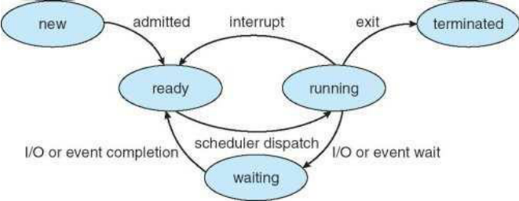

#Process & Thread

OS 的概念

##Process

Program - passive(被動) entity: binary stored in the **disk**, just a **file**

Process - active entity: a program **in excution in memory**

因為在 memory，我們的 CPU 才可以去 access

### A process includes:

1. Code Segment: compile 好的 text section
2. Data Section: 存放 global variables
3. Stack: **temporary** local variables and functions
4. Heap: **dynamic** allocated variables(e.g. usage of malloc) or classes
5. Current Activity: program counter, register counter
6. A Set of Associated resources: open files handlers

### 一個 Process 的 Memory 空間示意圖

### Process State Diagram

## Thread

1. lightweight process

   basic unit of CPU utilization

   有些 memory 空間是共用的，如下圖紅色區塊

2. All threads are belonging to the same process share

   code section

   data section

   OS resources(e.g. open files and signals)

3. Each thread has its own thread ID, program counter, register set and a stack(執行的位置可以不一樣)

### 示意圖

### 用途

Thread 常被運用在網路伺服器之設計上。以 Web server 為例，Web server 常需服務大量用戶請求。

1. single-thread

   若以一個傳統 single-thread 的 process 來實現 web server，當 web server 在服務某個請求而需讀取網頁之檔案時，可能會導致 web server 進入等待狀態(假如 web server 用 synchronous I/O讀檔案)。  此時雖有許多用戶等待服務，web server 卻也不能去服務，導致用戶較長的等待時間，Web server之服務效能不佳，如下圖(1)。

2. create process

    若 web server 以 create_process 方式，在每次有用戶請求時產生一個 process 以服務一個用戶，此方法可以使 web server 同時服務多個用戶，但create_process ，及切換 prcoess 執行之 overheads 很高，因此不見得有好效能，如下圖(2)。

3. create thread (multi-threads)

   若 web server 以 create_thread 方式，在每次有用戶請求時產生一個 thread以服務一個用戶，此方法可以使 web server 的服務效能增加，因 create_thread ，及在同一個 process 中切換 thread 執行之 overheads 較低，如下圖(3)。 

## Reference Link

[1] OS Course http://ocw.nthu.edu.tw/ocw/index.php?page=courseList&search=1&type=course

[2] http://ccu-cs-os2009s-495410049.blogspot.tw/2009/06/os-process-thread-part-2.html

