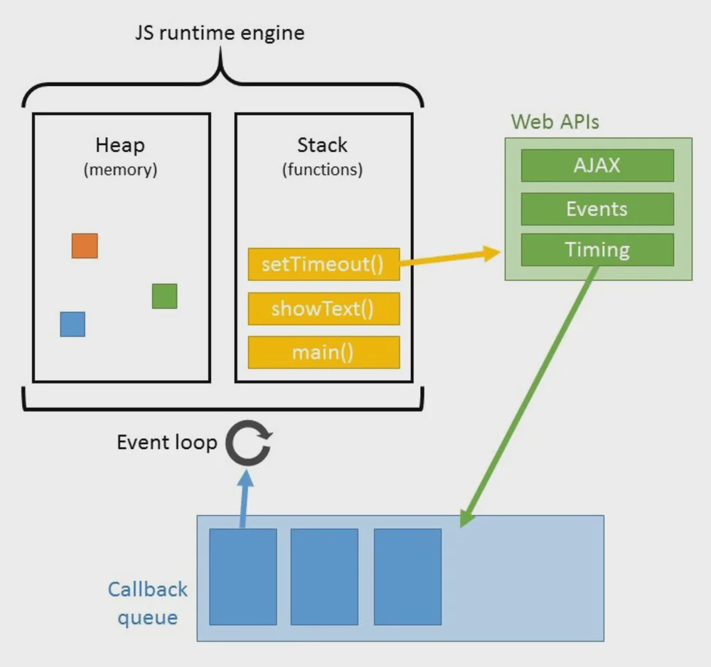

# Event Loop

JavaScript 的特色是 Runtime 為 **Single Thread**，也就是只有一個 Call Stack，因此一個時間只能做一件事情。由於只有一個 Thread，只要遇到大量運算或資料流，JavaScript 就會停住等待（blocking），可能會造成等待時間過長、使用者體驗不佳。

>其他語言像是 C#，遇到大量運算時可使用 multi-thread 機制。
>
>Single Thread:
>
>- one call stack
>- one thing at a time

## Web APIs

為了解決等待時間過長的問題，**Browser** 做了擴充（V8 Engine 沒有 setTimeout 等 webAPIs），提供了三種 web APIs，讓程式的執行可以非同步進行。

- **DOM** (Document Object Model),  a programming interface for HTML and XML documents
  - addEventListener
  - click
- **AJAX** (Asynchronous JavaScript + XML), <u>XMLHttpRequest API</u> is the core of Ajax
- **setTimeout**

## Event Loop

我們之所以可以在瀏覽器中同時（concurrently）處理多個事情，是因為瀏覽器並非只有一個 JavaScript Runtime。

>JavaScript 的執行時期（Runtime）一次只能做一件事，但瀏覽器提供了更多不同的 API 讓我們使用，進而讓我們可以透過 event loop 搭配非同步的方式同時處理多個事項。

event loop 的作用是去監控堆疊（call stack）和工作佇列（task queue），當堆疊當中沒有執行項目的時候，便把佇列中的內容拉到堆疊中去執行，機制如下圖（[圖片來源](https://levelup.gitconnected.com/javascript-and-asynchronous-magic-bee537edc2da)）。

## Reference Link

[1] http://cek.io/blog/2015/12/03/event-loop/

[2] https://oomusou.io/ecmascript/async/event-loop-model

[3] https://pjchender.blogspot.com/2017/08/javascript-learn-event-loop-stack-queue.html

